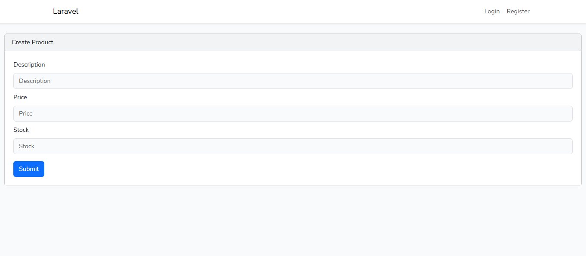
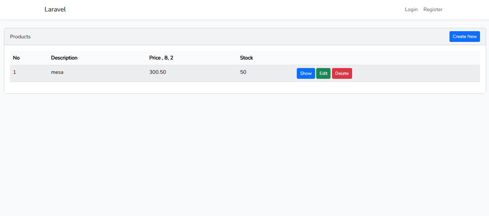

Universidad Tecnológica de Panamá

Facultad de Ingeniería de Sistemas Computacionales

Fecha de Ejecución: 23 de abril de 2026

Objetivos
Implementar un sistema CRUD utilizando Laravel para la gestión de datos.
Aplicar la arquitectura MVC (Modelo-Vista-Controlador) en el desarrollo del proyecto.
Utilizar las herramientas proporcionadas por Laravel para generar modelos, migraciones y controladores de manera eficiente.
Introducción

Laravel es un framework de desarrollo web basado en PHP que permite crear aplicaciones modernas y organizadas siguiendo el patrón MVC, facilitando la separación de responsabilidades y la mantenibilidad del código.

En este laboratorio, se desarrolló un sistema CRUD para la gestión de datos, aplicando las prácticas recomendadas de Laravel. Durante el proceso, se configuró el entorno de desarrollo, se instalaron las dependencias necesarias y se implementaron funcionalidades para crear, leer, actualizar y eliminar registros de forma efectiva.

Requisitos Previos

Para ejecutar correctamente el laboratorio, se requiere contar con el siguiente ecosistema de desarrollo:

PHP 8.0 o superior
Composer (última versión estable)
Laravel (framework PHP)
Servidor web: Apache
Base de datos: MySQL
Entorno de desarrollo local: XAMPP o WampServer
Editor de código: Visual Studio Code
Node.js y NPM (para gestión de dependencias del frontend)
Sistema operativo: Windows 10 / 11
Instalación y Configuración del Proyecto

A continuación, se detallan los pasos para instalar y ejecutar el proyecto Laravel desde cero:

1. Clonar o crear el proyecto

Si el proyecto ya se encuentra en un repositorio:

git clone URL_DEL_REPOSITORIO
cd login-app

Si se crea desde cero:

laravel new login-app
2. Instalación de dependencias
composer install
npm install
npm run dev
composer install: descarga las librerías del backend definidas en composer.json en la carpeta vendor/.
npm install: instala dependencias del frontend.
npm run dev: compila los archivos CSS y JavaScript.
3. Configuración del archivo .env

Laravel utiliza el archivo .env para manejar variables de entorno:

cp .env.example .env

Configurar la base de datos:

DB_DATABASE=crud_rapido
DB_USERNAME=root
DB_PASSWORD=
en mi caso no uso 
Este paso es fundamental para la correcta conexión entre Laravel y MySQL.

Comandos Utilizados
1. Limpieza de configuración
php artisan config:clear
php artisan cache:clear
php artisan config:cache

Permite limpiar y actualizar la configuración del proyecto.

2. Creación del modelo y migración
php artisan make:model Product -m

Crea el modelo Product junto con la migración correspondiente para la tabla products.

3. Ejecución de migraciones
php artisan migrate
php artisan migrate:fresh
migrate: crea las tablas definidas en las migraciones.
migrate:fresh: elimina todas las tablas existentes y las vuelve a crear desde cero.
4. Generación del CRUD
composer require ibex/crud-generator --dev
php artisan vendor:publish --tag=crud
php artisan make:crud products

Estos comandos permiten generar automáticamente los componentes del CRUD: modelos, controladores, vistas y rutas.

5. Implementación de la interfaz (Laravel UI)
composer require laravel/ui --dev
php artisan ui bootstrap

Genera vistas básicas con Bootstrap para la interfaz de usuario.

6. Actualización del autoload
composer dump-autoload

Actualiza el cargador de clases de Composer para reconocer nuevos archivos.

7. Ejecución del servidor
php artisan serve

Resultados 
## Resultados

### REGISTRO

### CRUD

La aplicación estará disponible en:

http://127.0.0.1:8000/ → Página de login
http://127.0.0.1:8000/products → CRUD generado
Referencias
Laravel. (2026). Documentación oficial de Laravel. Recuperado de https://laravel.com/docs
Informática DP. (2022, 20 de enero). CRUD RÁPIDO - LARAVEL [Video]. YouTube. Recuperado de https://www.youtube.com/watch?v=j5baJsM_Adc
Información del Estudiante
Nombre: Ruben Dominguez
Correo: Ruben.Dominguez1@utp.ac.pa
Curso: Desarrollo de Software VII
Instructor: Irina Fong
